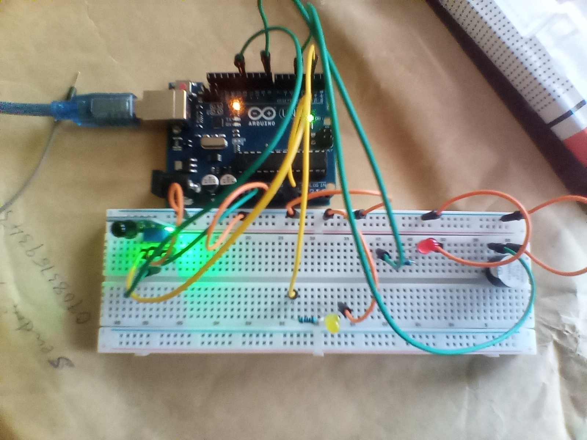

# Flame Sensor Alarm System – Arduino Project

## Overview
This project demonstrates flame detection using a flame sensor with both analog and digital outputs. When a flame is detected, an LED lights up and a buzzer sounds with a variable pitch depending on the intensity of the flame.

## Objective
- Learn to interface a flame sensor with Arduino
- Read analog and digital sensor inputs
- Control an LED and buzzer in response to sensor readings
- Understand mapping sensor input values to output signals
- Gain experience with real-time sensor monitoring and alarms

## Components Used
- Arduino Uno
- Flame sensor (analog + digital output)
- LED
- Yellow LED
- Buzzer
- 220Ω resistor
- Breadboard
- Jumper wires
- 9V Battery
- 9V Battery Clip to DC Barrel Jack

## Circuit Diagram

check out other images [click here](images/)

## How It Works
1. The flame sensor is connected to both an analog pin (`A0`) and a digital pin (`D12`) on the Arduino.  
2. The Arduino reads the analog sensor value using `analogRead()` and the digital value using `digitalRead()`.  
3. If the analog reading is below a threshold (indicating flame detection), the buzzer sounds with a pitch mapped to the analog value, and the main LED flashes on and off.  
4. If the digital sensor reads `LOW` (flame detected), a yellow LED also flashes.  
5. If no flame is detected, the buzzer and LEDs remain off.  
6. Serial output provides real-time monitoring of both analog and digital sensor values.

## Code
The Arduino sketch for this project is located in the [code/ directory](code/flame_module_project_on_30th_june_2025.ino)

## Demo Video
A demonstration video showing the working project is included in this repository.

📹 **Project Demonstration:**  
[Click here to watch/download the demo video](video/flame_sensor_video.mp4)

*(If the video does not preview directly on GitHub, please download it using the link above.)*

## Reflection (What I Learned)
- How to read both analog and digital sensor values
- How to generate variable tones on a buzzer using `tone()` and `map()`
- How to respond to real-time sensor readings with LEDs and alarms
- Improved understanding of sensor integration in Arduino projects

## Challenges Faced
- Determining the correct threshold for flame detection
- Coordinating buzzer pitch with analog sensor readings
- Wiring LEDs and buzzer to avoid interference
- Ensuring accurate detection under varying light conditions

## Possible Improvements
- Add multiple flame sensors for wider area detection
- Use PWM to create smoother LED flashing effects
- Trigger an external alert system (e.g., SMS or Wi-Fi notification) when flame is detected

## Project Status
Completed
